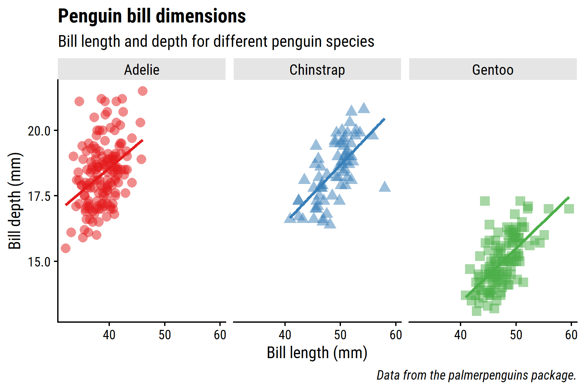
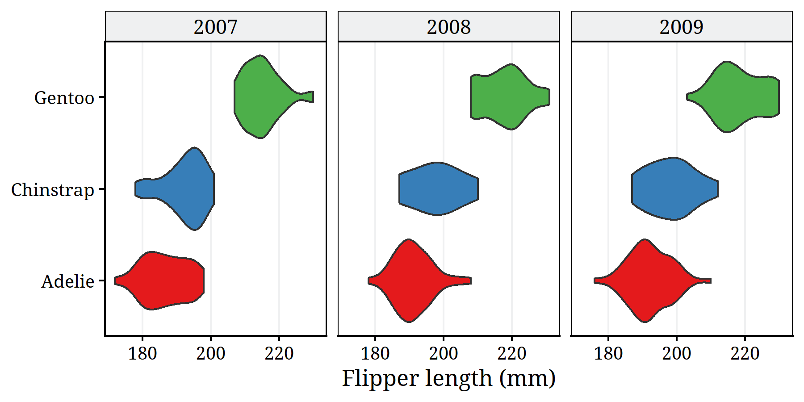
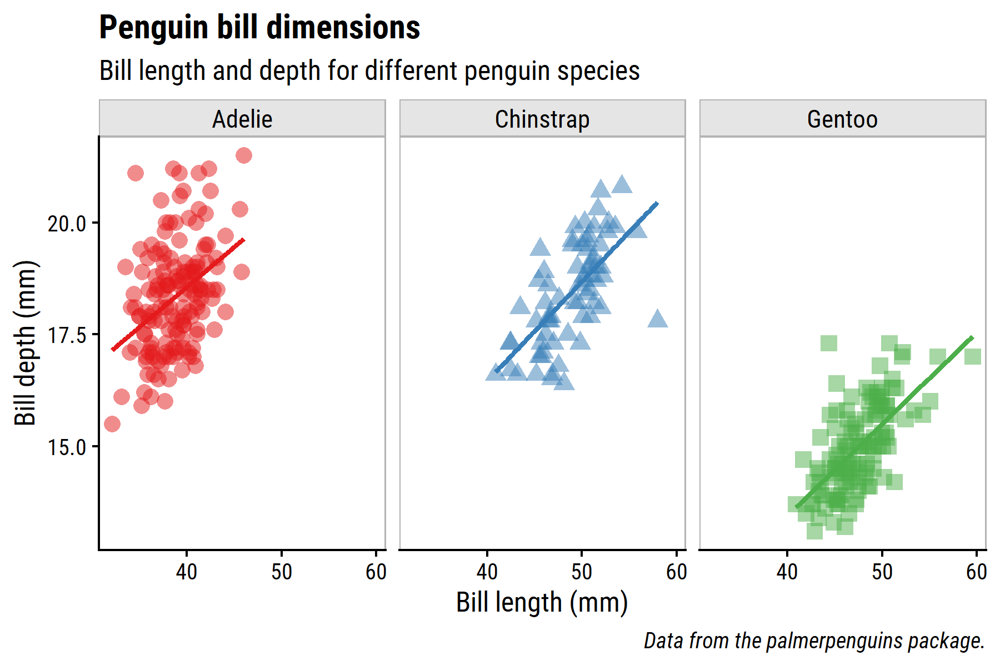

<!-- README.md is generated from README.Rmd. Please edit that file -->

# dunnr

<!-- badges: start -->
<!-- badges: end -->

The goal of `dunnr` is to compile various helper functions, templates,
and lists that I frequently use.

## Installation

``` r
# install.packages("remotes")
remotes::install_github("taylordunn/dunnr")
```

When installing to a project using `renv`, may have pass the
`--no-multiarch` option as follows:

``` r
remotes::install_github("taylordunn/dunnr", INSTALL_opts = c("--no-multiarch"))
```

This has something to do with `renv` checking for multiple architectures
when building packages, see [this
issue](https://github.com/rstudio/renv/issues/162).

## Plotting functions

### Themes

My go-to `ggplot2` theme can be applied with `theme_td()`:

``` r
library(dunnr)
library(ggplot2)
library(dplyr)
library(palmerpenguins)

p1 <- penguins %>%
  filter(!is.na(bill_length_mm)) %>%
  ggplot(aes(x = bill_length_mm, y = bill_depth_mm, color = species)) +
  geom_point(aes(shape = species), size = 3, alpha = 0.5, show.legend = FALSE) +
  geom_smooth(method = "lm", formula = "y ~ x",
              se = FALSE, show.legend = FALSE) +
  scale_color_brewer(palette = "Set1") +
  labs(title = "Penguin bill dimensions",
       subtitle = "Bill length and depth for different penguin species",
       x = "Bill length (mm)", y = "Bill depth (mm)",
       color = "Penguin species", shape = "Penguin species",
       caption = "Data from the palmerpenguins package.") +
  facet_wrap(~species, nrow = 1)
p1 + theme_td()
```



Note that the default font family here is Roboto Condensed, which can be
downloaded from [Google
Fonts](https://fonts.google.com/specimen/Roboto+Condensed) (to save
headaches on Windows, use the “Install for all users” option so that R
can find the font easily). Then to import and load the font:

``` r
extrafont::font_import(pattern = "Roboto", prompt = FALSE)
extrafont::loadfonts(device = "win", quiet = TRUE)
```

Alternatively, give another font as an argument,
e.g. `theme_td(base_family = "Arial")`.

`theme_td_grid()` is based on `theme_bw()` with minor tweaks, such as
slightly softer colors and Droid Serif as the default font:

``` r
p2 <- penguins %>%
  filter(!is.na(flipper_length_mm)) %>%
  ggplot(aes(x = flipper_length_mm, y = species)) +
  geom_violin(aes(fill = species), show.legend = FALSE) +
  labs(x = "Flipper length (mm)", y = NULL) +
  facet_wrap(~year) +
  scale_fill_brewer(palette = "Set1") +
  scale_x_continuous(breaks = seq(180, 220, 20))
p2 + theme_td_grid() +
  theme(panel.grid.major.y = element_blank())
```



`theme_td_grey()` is a low contrast theme that emphasizes title and
facet text:

``` r
p1 + theme_td_grey(base_size = 12)
```


### Palettes

The `td_colors` list has some of my commonly used palettes, which can
all be accessed via the `td_pal()` function. A qualitative palette with
pastel colors:

``` r
scales::show_col(td_pal(palette = "pastel6")())
```


A diverging blue-to-red palette:

``` r
scales::show_col(td_pal(palette = "div5")())
```


### Scales

These palettes can be easily applied to plots with the
`scale_color_td()` and `scale_fill_td()` functions:

``` r
library(patchwork)
p3 <- diamonds %>%
  filter(carat >= 2.2) %>%
  ggplot(aes(x = price, y = cut, fill = factor(cut, ordered = FALSE))) +
  geom_boxplot() +
  theme_td() +
  theme(legend.position = "none") +
  cowplot::background_grid(major = "x")
(p3 + scale_fill_td() + labs(title = "pastel6")) +
  (p3 + scale_fill_td("div5") + labs(title = "div5"))
```


``` r
p4 <- faithfuld %>%
  ggplot(aes(waiting, eruptions, fill = density)) +
  geom_tile() +
  theme_td() +
  scale_x_continuous(expand = c(0, 0)) +
  scale_y_continuous(expand = c(0, 0))
p4 +
  scale_fill_td(palette = "div5", type = "continuous", reverse = FALSE)
```


### `remove_axis()`

A common tweak I make to plots is to remove unnecessary axes, like in
density plots. The `remove_axis()` function saves a few lines of code:

``` r
p5 <- penguins %>%
  filter(!is.na(flipper_length_mm)) %>%
  ggplot(aes(x = flipper_length_mm)) +
  geom_density(aes(fill = species), alpha = 0.5) +
  scale_fill_brewer(palette = "Set1") +
  scale_y_continuous(expand = expansion(c(0, 0.1))) +
  labs(x = "Flipper length (mm)")
p5 + theme_td() +
  remove_axis("y")
```


### `add_facet_border()`

Sometimes when plotting facets, it helps to have some visual separation
in the panels. The `add_facet_border()` function is a quick way to do so
without adjusting `theme()` elements directly:

``` r
p1 + theme_td() + add_facet_borders()
```



### `set_geom_fonts()`

The `set_geom_fonts()` function sets the default fonts of `geom_text()`
and `geom_label()`. If no font is specified, it will automatically take
the font from the current `ggplot2` theme:

``` r
library(glue)
p6 <- penguins %>%
  count(species, island, name = "n_penguins") %>%
  ggplot(aes(y = species, x = n_penguins)) +
  geom_col(aes(fill = island)) +
  geom_label(aes(label = glue("{island}: n = {n_penguins}")),
             position = "stack", hjust = 1) +
  scale_fill_brewer(palette = "Set1") +
  scale_x_continuous(expand = expansion(mult = c(0, 0.1))) +
  labs(title = "Number of penguins per island",
       subtitle = "Different font",
       x = "Number of penguins", y = NULL,
       caption = "Data from the palmerpenguins package") +
  theme(legend.position = "none")

# By default, geom_label() doesn't have the same font as theme_td()
p6 + theme_td() +
  theme(legend.position = "none")
```


``` r
# But if we set the theme
theme_set(theme_td())
# And then set fonts with the helper function
set_geom_fonts()

p6 + theme_td() +
  theme(legend.position = "none") +
  labs(subtitle = "Same font")
```


### `set_palette()`

The `set_palette()` function is a convenient way to quickly set the
default discrete palette (via `ggplot2.discrete.fill` and
`ggplot2.continuous.fill` options) and the default continuous palette
(via `ggplot2.continuous.fill` and `ggplot2.continuous.colour`):

``` r
set_palette()
(p3 + labs(title = "Discrete palette")) +
  (p4 + labs(title = "Continuous palette"))
```


