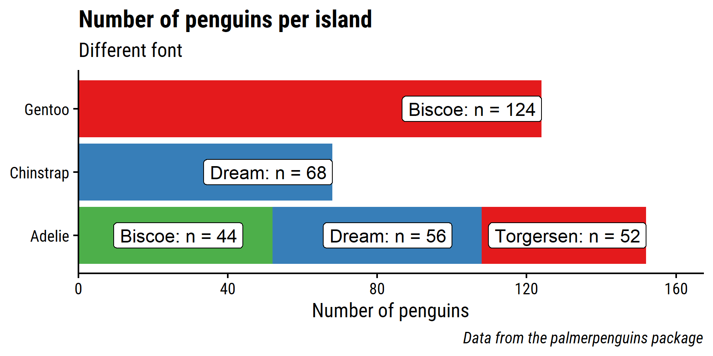

<!-- README.md is generated from README.Rmd. Please edit that file -->

# dunnr

<!-- badges: start -->
<!-- badges: end -->

The goal of `dunnr` is to compile various helper functions, templates,
and lists that I frequently use.

## Installation

``` r
# install.packages("remotes")
remotes::install_github("taylordunn/dunnr")
```

## Plotting functions

### Themes

My go-to `ggplot2` theme can be applied with `theme_td()`:

``` r
library(dunnr)
library(ggplot2)
library(dplyr)
library(palmerpenguins)

p1 <- penguins %>%
  filter(!is.na(bill_length_mm)) %>%
  ggplot(aes(x = bill_length_mm, y = bill_depth_mm, color = species)) +
  geom_point(aes(shape = species), size = 3, alpha = 0.5) +
  geom_smooth(method = "lm", formula = "y ~ x", se = FALSE) +
  scale_color_brewer(palette = "Set1") +
  labs(title = "Penguin bill dimensions",
       subtitle = "Bill length and depth for different penguin species",
       x = "Bill length (mm)", y = "Bill depth (mm)",
       color = "Penguin species", shape = "Penguin species",
       caption = "Data from the palmerpenguins package") +
  facet_wrap(~species, nrow = 1)
p1 + theme_td()
```

<!-- -->

Note that the default font family here is Roboto Condensed, which can be
downloaded from [Google
Fonts](https://fonts.google.com/specimen/Roboto+Condensed) (to save
headaches on Windows, use the “Install for all users” option so that R
can find the font easily). Then to import and load the font:

``` r
extrafont::font_import(pattern = "Roboto", prompt = FALSE)
extrafont::loadfonts(device = "win", quiet = TRUE)
```

Alternatively, give another font as an argument,
e.g. `theme_td(base_family = "Arial")`.

### Palettes

### `remove_axis()`

A common tweak I make to plots is to remove unnecessary axes. The
`remove_axis()` function saves a few lines of code:

``` r
p <- penguins %>%
  filter(!is.na(flipper_length_mm)) %>%
  ggplot(aes(x = flipper_length_mm)) +
  geom_density(aes(fill = species), alpha = 0.5) +
  scale_fill_brewer(palette = "Set1") +
  scale_y_continuous(expand = expansion(c(0, 0.1))) +
  labs(x = "Flipper length (mm)")
p + theme_td() +
  remove_axis("y")
```

<!-- -->

### `add_facet_border()`

Sometimes when plotting facets, it helps to have some visual separation
in the panels. The `add_facet_border()` function is a quick way to do so
without adjusting `theme()` elements directly:

``` r
p1 + theme_td() + add_facet_borders()
```

<!-- -->

### `set_geom_fonts()`

The `set_geom_fonts()` function sets the default fonts of `geom_text()`
and `geom_label()`. If no font is specified, it will automatically take
the font from the current `ggplot2` theme:

``` r
library(glue)
#> 
#> Attaching package: 'glue'
#> The following object is masked from 'package:dplyr':
#> 
#>     collapse
p <- penguins %>%
  count(species, island, name = "n_penguins") %>%
  ggplot(aes(y = species, x = n_penguins)) +
  geom_col(aes(fill = island)) +
  geom_label(aes(label = glue("{island}: n = {n_penguins}")),
             position = "stack", hjust = 1) +
  scale_fill_brewer(palette = "Set1") +
  scale_x_continuous(expand = expansion(mult = c(0, 0.1))) +
  labs(title = "Number of penguins per island",
       subtitle = "Different font",
       x = "Number of penguins", y = NULL,
       caption = "Data from the palmerpenguins package") +
  theme(legend.position = "none")

# By default, geom_label() doesn't have the same font as theme_td()
p + theme_td() +
  theme(legend.position = "none")
```

<!-- -->

``` r
# But if we set the theme
theme_set(theme_td())
# And then set fonts with the helper function
set_geom_fonts()

p + theme_td() +
  theme(legend.position = "none") +
  labs(subtitle = "Same font")
```

<!-- -->
